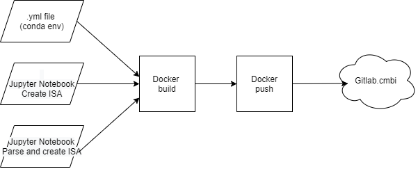
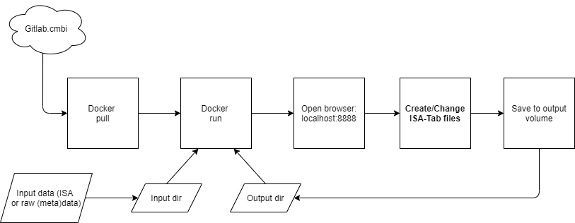

# Isatools_environment
Computational environment to work with Isatools

# Contribution Guidelines

Contribution to this repository is much appreciated. In order to keep the repository clear and structured, we have a few guidelines:

- If you want to add a feature or see coding parts that can be improved, create a new branch according to the [naming conventions](https://codingsight.com/git-branching-naming-convention-best-practices/)
- Use descriptive commit names

# Content

This repository is made to demonstrate how to create a virtual environment (conda) and container (Docker) that provides all necessary software to work with ISA-tab files. A template is present on how to work create/modify ISA-tab files.

## File structure

### /Docker

Directory containg all files needed to build to Docker image. The `Dockerfile` must be used to build the Docker container. It defines the container's content and structure. The `isa_env.yml` file is needed to build the conda environment inside the container. The `isa_parse.ipynb` file is a Jupyter notebook file that demonsrates how to parse ISA-Tab files with isatools. 

### /Docker_setup

This directory contains files that describe all steps that have been done prepatory for this repository.vThe `create_isa_env_yml.sh` file was used to create the conda environment (isa_env) and export this environment to a .yml file, which is used to build the Docker container. The `Push_docker_registry.sh` file describes how the casperdevisser/isatools_environment image was pushed to the registry.

### /Flowchart

Directory containing .png files of flowcharts that give a schematic overview of the Docker container

### /Singularity

Directory containing the components to build the Singularity container (which can be used in the exact same way as the Docker container). The `Dockerfile` must be used to build the Docker container. It defines the container's content and structure. The `isa_env.yml` file is needed to build the conda environment inside the container. The `isa_parse.ipynb` file is a Jupyter notebook file that demonsrates how to parse ISA-Tab files with isatools. The `isa.def` file is the Singularity definition file, which must be used to build the singularity container.

# Docker image usage

## How to get the Docker container

### Build Docker from repo 
```
cd Docker/
Docker build -t casperdevisser/isatools_environment .
```

### Pull Docker image from DockerHub 

```
docker pull casperdevisser/isatools_environment:v0.4
```

## When working on the Digital Research Environment (DRE):

Pulling from Dockerhub and building from the Dockerfile is not an option in the DRE. However, the Docker image can be uploaded as .tar file to the DRE, where it can be loaded. Instructions on this can be found [here](https://gitlab.cmbi.umcn.nl/x-omics/xomicsdre/-/wikis/Linux/Docker#test-docker-installation-and-transfer-images) (Access restricted to X-omics Gitlab members)

## How to run the Docker Container
```
docker run -it -v $(volume):/isa_container/volume -p 8888:8888 casperdevisser/isatools_environment
```

- **$(volume)** is the absolute path to directory where you store input data. Example input: `~/ngms-isa-casperdevisser/Example_input/MTBLS1437_compressed_files`. 
Mount current directory, Windows Command Line: 'docker run -it -v %cd%:/isa_container/volume ...', PowerShell: 'docker run -it -v ${PWD}:/isa_container/volume ...', Linux: 'docker run -it -v $(pwd):/isa_container/volume ...'

- Open `localhost:8888` in a browser (outside of the docker). 

- If running the container inside the Windows DRE, use the ip-adress that is returned by the command `docker-machine ip`. For example: `xxx.xxx.xx.xx:8888`. 

- If token is required for login, copy paste the token that can be found in one of the URLs that is given as output after the docker run command. 

Now you can use isatools
# Flowchart
## Building the Docker image



## Using the ISA-Docker container



# Commit changes to Docker container (and create new image)

Run container in background and print CONTAINER_ID

```
docker run -it -d isatools_environment
```

Run image iteractively (use the CONTAINER_ID that was printed with the previous command)

```
docker exec -it CONTAINER_ID bash
```

Once inside the container, install new packages to the conda environment:
 ```
 conda activate isa_env
 conda install numpy
 ```

Exit the container:

```
exit
```

Commit the changes on your local PC terminal and give image new tag (currently, we use the date at the moment of pushing as tag name):

```
docker commit -m "<describe changes made to container>" CONTAINER_ID casperdevisser/isatools_environment:<new_tag_name> #for example: 12_08_21
```

[More information](https://www.techrepublic.com/article/how-to-commit-changes-to-a-docker-image/)

# Run Singularity container

Build from isa.def:

```
cd Singularity
sudo singularity build isa.sif isa.def
```

Run container:

```
sudo singularity run --bind /home/<user.name>@mydre.org/isa_action/notebooks:/isa_workdir isa.sif
```
Opening the lnk to the Jupyter notebook requires the exact same steps as with the Docker image (see 'Run Docker Container' above)
